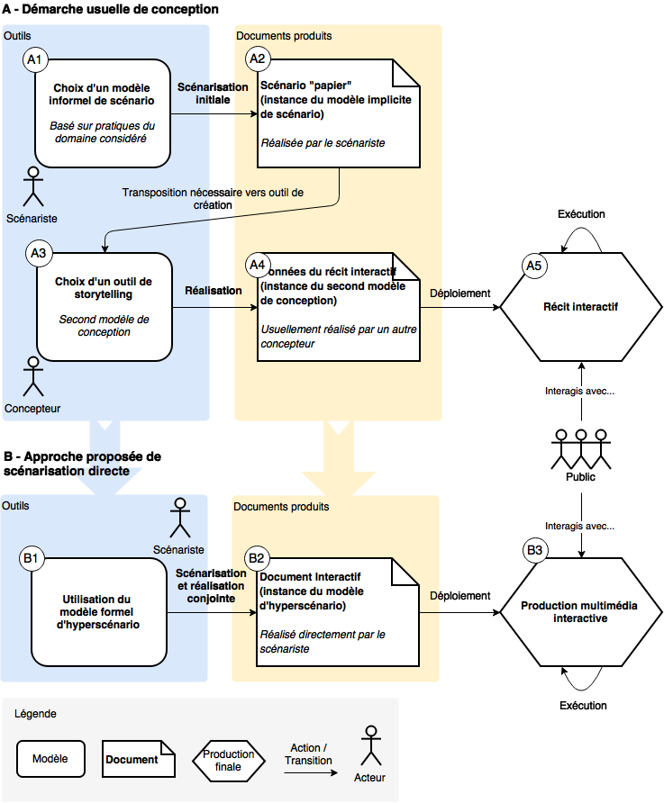
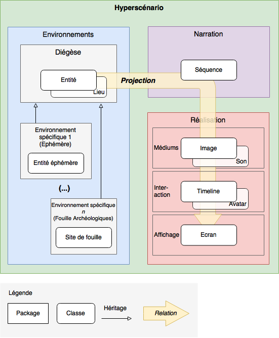
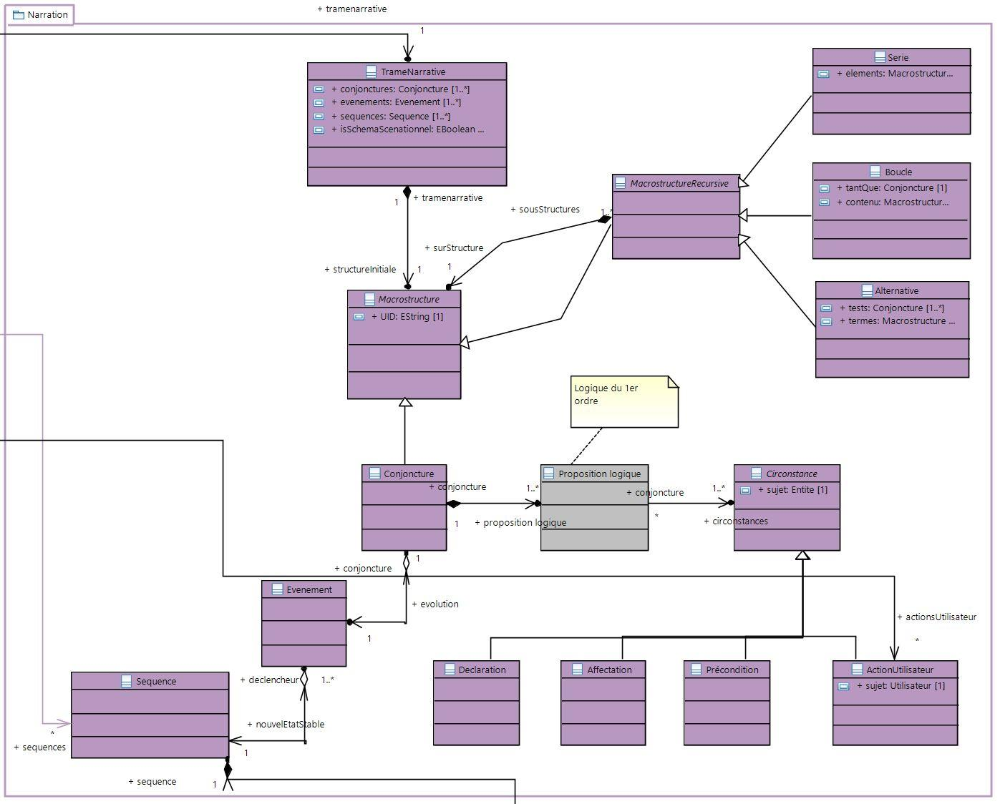
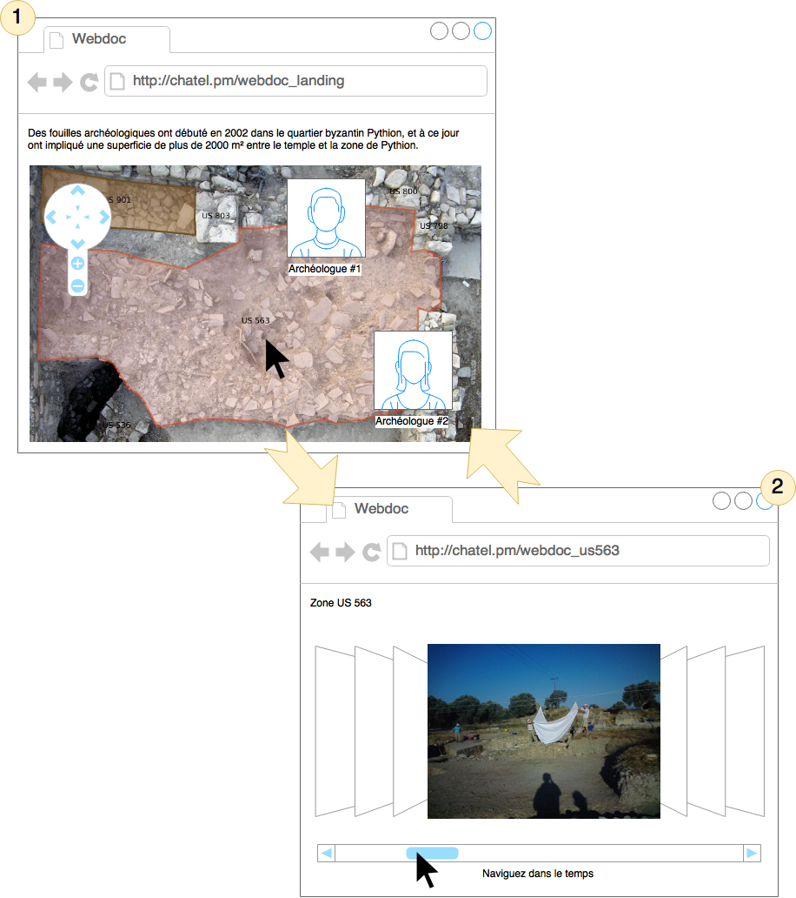

# Une approche hypermédia pour la valorisation auprès du grand public de données patrimoniales numériques

***A hypermedia approach for digital heritage data promotion to the general public*** 

**Pierre Châtel-Innocenti (1), Guillaume Besacier (2)**

Université Paris 8  - Laboratoire Paragraphe / Equipe CITU

2 rue de la Liberté, Saint-Denis, 93526, France

(1) pierre.chatel@univ-paris8.fr 

(2) guillaume.besacier@univ-paris8.fr 

**Résumé**. Dans cet article, nous proposons une approche hypermédia dédiée à la valorisation auprès du grand public de données patrimoniales numériques issues de l’éphémère, et son application à des données scientifiques de fouille archéologique. Nous détaillons notre approche de scénarisation et le type de réalisations hypermédiatiques qu’elle vise et présentons une version préliminaire simplifiée du modèle formel au cœur de la contribution scientifique. Des perspectives scientifiques et techniques en informatique sont abordées, en prévision de futurs travaux d’implémentation logicielle autour du modèle proposé.

> [La version courante du méta-modèle d'hyperscénario](https://github.com/chatelp/hyperdocuments-metamodel/tree/master/hyperdocuments-metamodel) est disponible dans ce même projet GitHub. Elle est à ouvrir avec l'outil [Papyrus pour Eclipse](https://eclipse.org/papyrus/).

**Mots-clés**. Hypermédia, Scénarisation, Patrimoine Augmenté, Médiation, Ingénierie Dirigée par les Modèles (IDM) Hyperscénario

**Abstract.** In this paper, we propose a hypermedia approach for promotion of ephemeral digital heritage data to the general public, and its application to scientific archaeological data. We describe our scenarization approach and the hypermedia objects it aims at producing and present a simplified preliminary version of the formal model at the heart of the scientific contribution. Scientific and technical perspectives are discussed, in anticipation of a future software implementation of the proposed model. 

**Keywords**. Hypermedia, Scenarization, Smart Heritage, Mediation, Model-Driven Engineering (MDE), Hyperscenario

**Table des matières**

[[TOC]]

# 1. Introduction

Nous présentons une approche hypermédia dédiée à la valorisation auprès du grand public de données patrimoniales numériques issues de l’éphémère, ainsi qu’un exemple de son application aux données recueillies sur le site archéologique byzantin de Gortyne (Zanini, 2003) : photos, dessins, plans, journaux de bord, etc. Cette approche inclut un outil informatique novateur et simple à mettre en oeuvre : un modèle de conception d’objets hypermédias massivement distribuables, qui s’inspire des pratiques créatrices communes à plusieurs domaines - tels que l’écrit, l’audiovisuel et le numérique - en tirant parti du concept de *scénario.* 

En effet, nous avançons que ces données patrimoniales ont un fort potentiel de valorisation (culturelle, artistique, pédagogique, etc.) auprès du grand public, mais qui reste le plus souvent inexploité pour deux raisons principales : elles sont recueillies par des scientifiques, donc difficiles d’accès pour des non-experts; et elles sont issues d’un contexte éphémère, donc fortement contraint. Par ailleurs, ce public est de plus en plus sensibilisé à l'intérêt des sites historiques tels que Gortyne, mais ses attentes en termes de richesse des contenus numériques et de possibilités d’interactions les objets médiateurs (reportages, récits, documentaires, etc.) sont elles aussi de plus en plus importantes et les outils de création doivent permettre au concepteur d’y répondre. 

Nous identifions également l’éphémère comme une caractéristique déterminante pour la médiation : elle est ici entendue comme une caractéristique temporelle d’un événement par nature transitoire et va influencer les données patrimoniales numériques captées autour de l'événement. Il est donc nécessaire de prendre en compte ces spécificités lors de leur médiation par notre approche. De plus, sa définition de courte durée, périssabilité, ou instantanéité (NOTE:  http://www.cnrtl.fr/definition/ephemere) peut tout aussi bien désigner le cadre spécifique des fouilles archéologiques que celui des événements d’actualité ou des performances artistiques. Ce qui implique que notre approche pourrait, à terme, être appliquée à d’autres contextes que celui choisi pour ces premiers travaux. De fait, ce contexte de fouille a une valeur illustrative et les valorisations sont données à titre d’exemple : notre objectif est de fournir à tout un chacun les moyens pour réaliser ses propres créations hypermédiatiques. Nous souhaitons ainsi participer positivement à la modification du rapport au savoir et à la culture qu'entraîne la révolution numérique dans nos sociétés hyperconnectées en favorisant l’analyse et la mise en contexte.

Dans la section [2](#heading=h.4fmy9seh2b3z) nous proposons notre approche pour la scénarisation directe de données patrimoniales sous forme d’objets hypermédias. La section [3](#heading=h.7a2oslqsr8qv) détaille notre principale contribution : le modèle non linéaire et générique d’hyperscénario. Enfin, les sections [4](#heading=h.17ngocz6f95s) et [5](#heading=h.b8vqtn4qtcn6) donnent un exemple d’application de cette approche sur un cas spécifique : les fouilles archéologiques de Gortyne.

# 2. Approche proposée : scénarisation directe de données patrimoniales sous forme d’objets hypermédias

Nous identifions deux types d’impact de l’éphémère sur les données patrimoniales :  un impact *qualitatif* lié aux conditions particulières de production (par exemple, une forte contrainte de temps au moment de la captation photographique qui peut entraîner un mauvais cadrage, ou une dégradation pendant la fouille qui se retrouvera sur les numérisations) et un impact *quantitatif* et *temporel* portant sur la variété et la disponibilité des données une fois l’événement terminé, une campagne de fouille archéologique étant nécessairement limitée dans le temps. 

Nous nous concentrons sur ce second type d’impact. En effet, les données patrimoniales numériques, même issues d’un contexte éphémère et limitées en nombre, peuvent être pérennisées et rendues accessibles par différents biais et sous différentes modalités - elles sont pour les fouilles de Gortyne accessibles de manière ouverte sur un Wiki sémantique public (Costa et Carabia, 2015). Notre approche exploite le concept de *scénario* pour permettre de "raconter une histoire" autour de ces données, et de les mettre en rapport, pour en faire ressortir le sens malgré les difficultés d’accès pour le grand public, inhérentes à leur contexte scientifique et éphémère.

La scénarisation est une démarche de conception et de contextualisation ayant fait ses preuves dans de nombreuses disciplines et qui repose sur le scénario comme modèle d’une production le plus souvent à destination du grand public : il est le modèle d’un récit dans le *storytelling *(Birch et Heckler, 1996; Hodge et al., 2002), d’une production dans l’audiovisuel, des interactions dans l’hypermédia (Balpe, 1990), et du *gameplay* dans les jeux vidéos (Genvo, 2005). Cependant, le terme de scénario cache en fait une forte disparité sémantique. Dans le langage courant, un scénario est le plus généralement un canevas, ou un plan détaillé, comprenant un découpage temporel; par exemple d’un film sous forme de scènes. "Scénariser", organiser sous forme de scénario une histoire, c’est la décrire scène par scène :  le scénario correspond alors au modèle structuré de cette description. Prolongée dans le cadre de nos travaux, cette démarche correspond à organiser sous une forme hypermédiatique des données numériques, afin de les contextualiser et les rendre attractives pour le plus grand nombre sous une forme interactive.

Cependant, puisque nous proposons une approche hypermédiatique de conception, le scénario ne peut alors ici s’entendre comme une définition linéaire : il ne va pas décrire une continuité narrative fixe, mais un ensemble de parcours possibles pour le "lecteur". Le scénario est alors lui-même un document hypermédia comprenant l’ensemble des éléments sur lesquels se fonde le récit (éléments de diégèse, média, etc., section [3](#heading=h.7a2oslqsr8qv)) auquel s’ajoute la formalisation des possibilités de parcours réalisés dans le cadre de l’expérience utilisateur (*i.e. *la trame narrative non linéaire, section [3.2](#heading=h.ibielwq5554m)).

Ainsi, pour obtenir l’ensemble de ces caractéristiques, nous avons défini notre propre modèle de *scénarios* *hypermédiatiques* : les *hyperscénarios*, et avons retenu l'ingénierie dirigée par les modèles (IDM) (Jézéquel et al., 2012; Schmidt, 2006) comme cadre formel de ce modèle et de notre approche. Dans ce contexte, les scénarios créés deviennent des *instances* du modèle d’hyperscénario, lui-même instance du *méta-modèle* UML (Object Management Group, 2004). L’IDM nous permettra, à terme, de réaliser l’outillage informatique de notre approche et de générer les objets interactifs à partir des scénarios instances de notre modèle.

> [La version courante du méta-modèle d'hyperscénario](https://github.com/chatelp/hyperdocuments-metamodel/tree/master/hyperdocuments-metamodel) est disponible dans ce même projet GitHub. Elle est à ouvrir avec l'outil [Papyrus pour Eclipse](https://eclipse.org/papyrus/).

Enfin, notre approche permettra la conception directe par un scénario de productions multimédias interactives, sans étapes ou outils ultérieurs, contrairement à l’usage habituel des scénarios comme simples "plans" initiaux de conception pour des productions en attente de réalisation par un autre outil, ou comme “maquette d’un film sous une autre forme” (Carrière, 1986). On réduit ainsi le délai entre une idée de création numérique et sa mise en production en éliminant la distinction usuelle entre les étapes de scénarisation et de réalisation au profit d’une construction organique de la production finale pendant laquelle les considérations de choix des médiums et de leur agencement s'entremêlent.. La figure [1](#bookmark=id.2xgcgffvwute) présente de manière comparée les étapes nécessaires pour la conception d’un récit interactif patrimonial, avec ou sans notre approche‌ : en *A*, on résume la démarche créative usuelle de scénarisation (*e**.g. *définition de synopsis, canevas, continuité dialoguée, storyboard, etc.) basée sur un modèle informel de scénario (A1). Le scénario créé (A2) devra ensuite être transposé à un outil numérique de storytelling (*e.g.* Racontr (NOTE:  http://racontr.com/), Klynt (NOTE:  http://www.klynt.net/), Inform (Montfort, 2005; Nelson, 2001), Twine (Friedhoff, 2013), Panda Suite (NOTE:  https://pandasuite.com/)) imposant son propre modèle de conception (A3) pour obtenir les données finales du récit (A4) et le récit lui-même (A5). A l’inverse, l’approche que nous proposons (B) ne se repose pas sur d’autres outils de conception externes autres que le modèle formel d’hyperscénario (B1); l’instance obtenue (B2) est déjà une spécification hypermédiatique complète et autocontenue de la production interactive finale (B3). On passe ainsi de quatre à deux étapes nécessaires.

 

**_Figure 1._*** Comparaison des étapes nécessaires à la** conception** d’un récit interactif*

# 3. Modèle non linéaire et générique d’hyperscénario

Notre définition du modèle d’hyperscénario permet d’adjoindre généricité et non-linéarité au concept de scénario défini dans la section précédente. Cette définition est en partie fondée sur des éléments conceptuels de la *scénistique* (Leleu-Merviel, 1996). Nous retenons ainsi le principe d’une définition explicite, dans un "modèle conceptuel", de la *diégèse* (NOTE:  La diégèse correspond à la définition par le scénariste de toutes les entités (lieux, objets, personnages, etc.) qui peuplent le récit; visibles ou non pour public final et régi par un ensemble de règles (Durand, 1997; Souriau et Agel, 1953).) et d’une *trame narrative* élaborant la “logique des péripéties de la narration” sous forme de *séquences*; ainsi que le besoin d’une “mise en situation” finale (Leleu-Merviel, 2005) lors de la *réalisation*.

Cependant, nous nous distinguons de la scénistique en cela que le modèle ne présente pas de dualité entre *narration* (structure profonde de la logique narrative) et *scénation *(structure "de surface" proposée au public et potentiellement indépendante de la narration). Dans notre modèle, la trame narrative correspond directement à l’organisation des états de l’objet médiateur présenté au public (donc à une structuration de surface). Pour chaque séquence définie, elle est combinée à un ensemble de *projections* : une projection correspond au choix, pour un élément donné de la diégèse et dans le cadre d’une séquence narrative spécifique, d’un ensemble de médiums (images, sons, vidéos, *etc.*) et de modalités d'interaction qui serviront à représenter cet élément diégétique dans l’objet médiateur final proposé au public. Nous introduisons ce concept dans notre approche comme une forme simplifiée et indirecte de scénation où la mise en scène est une “mise en écran”. Une conséquence directe, par rapport à la notion de *scénario étendu* (Leleu-Merviel, 2005), est que des choix concrets de réalisation pourront être effectués au moment même de la scénarisation. Cette simplification est rendue possible par le type de médiations spécifiquement visées par ce modèle : les objets numériques et hypermédiatiques massivement distribuables, et non les films ou mises en scène. 

Les sections suivantes présentent la représentation globale simplifiée du modèle d’hyperscénario ainsi qu’une proposition de modélisation non linéaire de la narration. 

## 3.1. Représentation globale simplifiée du modèle d’hyperscénario

**_Figure 2._*** Représentation graphique du modèle d’hyperscénario*

La figure [2](#bookmark=id.rjk859q3pccl) présente la représentation graphique simplifiée de notre modèle d’hyperscénario dont la spécification complète est en cours de finalisation et sera publiée dans de prochains travaux. Notre approche, fondée sur l'ingénierie dirigée par les modèles, pose les bases nécessaires pour le futur outillage informatique des hyperscénarios. Ses principes les plus importants sont les suivants :

**Représentation de tous les concepts principaux du modèle sous forme de classes** qui pourront être instanciées pour créer un scénario spécifique (*e.g.* la classe *Lieu* (NOTE:  Ce style sert à référencer dans le corps du texte les éléments du modèle.) parente de tous les lieux d’un scénario donné). Chaque classe dispose d’attributs typés, permettant de caractériser les instances (*e.g.* l’attribut *nom* de la classe *HyperScénario* ou l’attribut *Coordonnées gps* pour un *Lieu*), et de méthodes définissant leurs comportements possibles. De plus, certaines classes sont en relation de sous-typage (*e.g.* la classe *Personnage* qui hérite de *Entité*). 

**Découpage du modèle en ****_packages _****et ****_sous-packages _****par thématique traitée** : définition du monde du récit dans le package *Environnements* avec un sous-package *Diégèse* pour toutes les classes diégétiques génériques ainsi que des sous-packages pour des environnements diégétiques spécifiques et prévus à l’avance (*e.g.* sous-package *Éphémère** *avec la classe *Entité éphémère** *qui hérite de la classe *Entité* générique; sous-package *Fouille Archéologique* pour regrouper toutes les classes diégétiques spécifiques à ce domaine, comme une classe *Site de Fouille*). Définition dans le package *Narration* de la trame narrative du scénario sous forme d’un ensemble de *Séquence *organisées grâce à un ensemble de structures logiques (section [3.2](#heading=h.ibielwq5554m)). Définition de l’ensemble des éléments nécessaires à la réalisation du scénario sous la forme d’un objet médiateur spécifique proposé à l'interaction du public : choix de *Médiums* spécifiques (*e.g.* *Image*, *Son*), des modalités d’interaction (on propose des modalités configurables comme une *Timeline* ou un *Avatar*), le tout affiché sur un *Ecran*.

**Relations logiques entre les classes du modèle (et leurs instances lors d’une scénarisation donnée)**. Par exemple, *Projection* est une classe effectuant une relation majeure entre les trois principaux sous-packages du modèle. On illustre ainsi sur la figure [2](#bookmark=id.rjk859q3pccl), sous la forme d’une flèche jaune, la projection, d'une *Entité* diégétique d'une *Séquence* narrative, sous la forme d'une *Timeline* constituée d'*Image* affichées sur un *Ecran*. Une instance de *Timeline* aura été ici choisie par un scénariste, car elle permet de représenter l’évolution dans le temps d’une entité diégétique éphémère (comme un *Site de fouille*) à l’aide de plusieurs photographies et d’une ligne de temps interactive (cf. section [5](#heading=h.b8vqtn4qtcn6) pour un exemple de mise en oeuvre).	

**Généricité et extensibilité**, issues de l’utilisation du méta-modèle UML, garants de la pertinence du modèle auprès de différents scénaristes et publics dans différents domaines. Pour la diégèse, on fournit un vocabulaire générique (classes *Entité*, *Lieu*, *Personnage*, etc...), ainsi qu’un ensemble de vocabulaires spécifiques (sous-package *Ephémère*, *Fouille Archéologique*, etc. et leurs classes). Cependant, l’ensemble du modèle sans exception (y compris la diégèse) est extensible : il est possible pour tout un chacun d’y introduire de nouveaux packages de diégèse et de nouvelles classes. En effet, la trame du récit est toujours bâtie à partir des connaissances qu’a l’auteur du public et de ses "promenades inférentielles" (Eco, 1985), mais il nous est impossible de proposer une ontologie globale de la production hypermédiatique : la généricité du modèle de scénario et ses capacités d’extension permettent d’y pallier.

## 3.2. Proposition de modélisation non linéaire de la narration

Le caractère linéaire ne pouvant s’appliquer dans le contexte des productions hypermédiatiques interactives (il n’y a pas un seul déroulement prévu, mais un ensemble de parcours potentiels du public), notre modèle permet la **description non linéaire des différentes hypothèses de circulation** de l’utilisateur dans la narration : nous nous reposons pour cela sur la notion de macrostructures narratives (Laubin, 2005, 2004) et introduisons le concept de macrostructures récursives. Ces deux éléments se retrouvent dans la modélisation préliminaire que nous proposons de la trame narrative, réalisée sous la forme d’un diagramme de classes ici présenté de manière graphique (figure [3](#bookmark=id.sr0cng72b50n)), utilisant UML comme méta-modèle formel.

 

**_Figure 3._*** Modélisation UML du package Narration dans un hyperscénario*

On distingue deux types principaux de macrostructure narrative dans cette modélisation : 

* Les *MacrostructureRecursive*, qui sont* *à rapprocher de la notion de structures de contrôle dans un langage de programmation. Elle est déclinée en trois sous-classes : *Serie*, *Boucle* et *Alternative*; qui permettent respectivement de combiner des *Séquence* en série, au sein de boucles ou sous forme d’alternatives conditionnelles (type *if-then-else*). Dans ce modèle, les séquences de la trame narrative sont traitées comme les expressions d’un langage de programmation. Ces macrostructures sont dites "récursives", car elles sont elles-mêmes composées d’autres macrostructures (récursives ou non) : *e.g. *une série composée de plusieurs alternatives, elles-mêmes composées de séries de séquences narratives.

* Les *Conjoncture*, qui sont dans notre modèle des macrostructures non-récursives (*i.e.* terminales) directement basées sur la notion éponyme dans la scénistique (Leleu-Merviel, 2005), elles sont introduites afin de permettre le déclenchement des *Séquence* de la trame narrative en fonction d’un certain nombre de *Circonstance* qui concernent des éléments de la Diégèse.

Les sections [4](#heading=h.17ngocz6f95s) et [5](#heading=h.b8vqtn4qtcn6) suivantes proposent une première mise en œuvre de l’approche et du modèle présentés ci-dessus dans le contexte d’application spécifique de données patrimoniales issues fouilles archéologiques.

# 4. Contexte d’application : fouilles archéologiques du site byzantin de Gortyne

Le site de Gortyne a fait l’objet de plusieurs campagnes de fouilles entre 2001 et 2015. Une campagne de fouille est un événement de courte durée, de une et quelques semaines, qui nécessite un déplacement et un équipement spécial. Elle répond donc à notre définition d’un événement éphémère, avec toutes les conséquences sur les données numériques produites durant la campagne de fouille. Dans les deux sections suivantes, nous allons développer un exemple de production multimédia créée en 2017 grâce à l’hyperscénarisation des données numériques issues de la campagne de fouille de 2010.

Ces données numériques, produites pendant la fouille, sont de nature très diverse et peuvent provenir de plusieurs sources. La source la plus prolixe est les archéologues ayant participé aux fouilles. Un *journal de bord*, détaillant le compte-rendu des activités jour par jour ou demi-journée par demi-journée, est écrit au moment même de la fouille. Les journaux de bord peuvent être partiels, décousus, voire même contradictoires entre leurs différents auteurs. Ils sont accompagnés de nombreuses *photographies *du site de fouille, documentant son état avant la fouille, après la fouille, et pendant la fouille. Toutes ces données sont fortement spatialisées. Elles sont accompagnées d’une part de plans et de croquis de l’ensemble ou d’une sous-partie du site de fouille, et d’autre part d’une nomenclature précise des espaces utilisant la terminologie scientifique du domaine de l’archéologie : le site est divisé en *environnements *numérotés de A1 à A27, chacun contenant plusieurs *unités stratigraphiques* numérotées de US0000 à US1070 d’une taille allant de quelques mètres carrés à quelques centimètres carrés. Les relations spatiales entre les US sont précisément décrites dans le wiki sémantique du projet de fouille : une US peut être à côté de, recouverte par, détruite dans, une autre US. Enfin, les environnements et les US peuvent être groupés dans une *activité* (numérotée de A001 à A099) qui va correspondre à l’interprétation archéologique de l’histoire du site : construction d’une route, extension d’un bâtiment, pillage d’une tombe, etc. à une date historique donnée.

Les données numériques incluent également des photographies, des croquis, des scanners 3D des objets excavés tels que des poteries, des pièces de monnaies, et d’autres artefacts historiques. Ces derniers sont répertoriés sous un numéro d’*inventaire* de INV 7535 à INV 8441 et systématiquement associés à l’US où ils ont été découverts. Contrairement aux données du précédent paragraphe, ces données peuvent avoir été créées par les archéologues après la fin de la campagne de fouille, lors du travail scientifique d’analyse. Il est important de noter que le concepteur du produit multimédia, l’*hyperscénariste*, n’est pas nécessairement un membre de l’équipe d’archéologues qui ont participé aux activités de fouille, pas plus qu’il n’a nécessairement de connaissances poussées dans le domaine de l’archéologie. Dans la même manière que le scénariste de films policiers peut écrire un scénario en s’inspirant d’un fait divers ancien et en consultant des articles de presse et des dossiers de la police sans être lui-même policier, l’hyperscénariste va utiliser des données produites lors d’un événement éphémère antérieur pour créer un produit multimédia. Cependant, à la différence du scénariste de film, l’hyperscénariste endosse également la casquette de réalisateur et va faire des choix de réalisation, de cadrage, de montage, en plus des choix de scénarisation : les *projections *(section [3](#heading=h.7a2oslqsr8qv)).

# 5. Mise en œuvre : valorisation hypermédia de données de fouille

Nous montrons dans cette section comment, à partir des données numériques produites à l’occasion de la campagne de fouille de 2010 à Gortyne, un hyperscénariste donné qui n’a pas de lien avec les archéologues (NOTE:  Tout comme les auteurs du présent article), va, en 2017, pouvoir créer un *webdoc* grâce à notre approche et l’instanciation de notre modèle. Un webdoc est une forme de produit multimédia à destination du grand public (Gantier, 2012) , ici réalisé pour mettre en valeur et susciter l’intérêt du public pour les activités archéologiques.

## 5.1. Définition d’un environnement diégétique spécifique

Les données numériques relatives à la fouille permettent à l’hyperscénariste de définir une diégèse (section [3.1](#heading=h.dspq30lafqq4)) de la campagne de fouille. Ainsi l’entité diégétique *Site de Fouille*, qui est un type de *Lieu*, regroupe l’ensemble du territoire géographique concerné. Des entités spécifiques, qui héritent également de la classe diégétique de base *Lieu*, permettent de représenter les environnements et les unités stratigraphiques. Les objets historiques issus des fouilles sont représentés par des instances de la classe *ObjetÉphémère* implémentant également l’interface *Entité de Fouille*, ce qui leur permet d’être associés à une énumération *Etat de Fouille*. En effet, le site de fouille évolue au cours de l’activité de fouille, en particulier quand plusieurs US sont superposées et que les archéologues ont physiquement enlevé une US pour accéder à la couche du dessous. La plupart de cette conception diégétique pourra être mise en place automatiquement par notre futur outil informatique, à partir des métadonnées sémantiques associées aux traces numériques laissées par l’événement éphémère.

A partir de la diégèse, l’hyperscénariste peut alors utiliser la couche narrative de notre modèle (section [3.2](#heading=h.ibielwq5554m)). Il crée une *TrameNarrative* pour contenir l’ensemble de son scénario. Notre futur outil informatique lui proposera différents types de *Macrostructure* qu’il pourra emboîter entre elles pour concevoir la trame, tels que des *Alternative*, ou des *Boucle*. Elles-mêmes sont composées de *Séquence*, qui instancient des éléments de la couche réalisation de notre modèle. Chaque élément de la diégèse a des affinités particulières pour être associé, ou représenté visuellement, par divers types d’éléments de réalisation via les projections. Par exemple, les lieux, structurés en sous-lieu (environement, unités stratigraphiques,...), ont des affinités pour être représentés par un plan interactif. Le plan interactif est un composant auto-contenu avec une facette  présentation (par exemple une photo aérienne du site de fouille), une facette comportement (possibilité pour le spectateur-utilisateur final de zoomer la carte, de se déplacer entre les lieux), et une troisième facette d’interfaçage avec l’hyperscénario (notion de lieu actuel de l’action scénaristique). Le tableau [1](#bookmark=id.2en9l7xiq1sy) présente des correspondances entre les éléments de notre modèle de diégèse et des techniques d'interaction issues de la littérature en informatique.

La facette interfaçage de chaque composant permet au spectateur-utilisateur final de contrôler sa progression dans l’hyperscénario. Par exemple, un dialogue avec un avatar représentant un *Habitant Local* peut déclencher une *Alternative* spécifique d’une *Macrostructure* narrative. L’hyperscénariste utilise donc tout à la fois la diégèse, les outils narratifs, et les éléments de réalisation pour créer un hyperscénario des fouilles.

<table>
  <tr>
    <td>Entités diégétiques</td>
    <td>Eléments de modèle réalisation</td>
  </tr>
  <tr>
    <td>Site de Fouille</td>
    <td>Plan interactif
Avatar de l’utilisateur à la position courante</td>
  </tr>
  <tr>
    <td>Interface Etat de Fouille (avant/pendant/après la fouille)</td>
    <td>Timeline permettant de changer la représentation médiatique (e.g. photo) de l’entité</td>
  </tr>
  <tr>
    <td>Archéologue
Habitant Local</td>
    <td>Avatar représentant les personnages
Interaction conversationnelle avec les avatars</td>
  </tr>
  <tr>
    <td>Objet de fouille</td>
    <td>Photographie cliquable
Croquis ou dessin sous forme de calques transparents déplaçables sur la photo
Visualisation 3D à partir de scans 3D</td>
  </tr>
</table>

**Tableau 1. ***Correspondances possibles entre les entités diégétiques de notre modèle et des éléments de réalisation particulièrement appropriés pour les représenter*

## 5.2. Prototype d’objet médiateur webdoc des fouilles de Gortyne

Nous avons prévu de fournir à terme l’ensemble des outils informatiques permettant la conversion automatique d’une instance de notre modèle d’hyperscénario à un objet médiateur interactif et distribuable, sans autre étape (ou outil) nécessaire que la définition du scénario et le choix des données associées. La figure [4](#bookmark=id.mprknyq6e9kw) présente le prototype d’un objet médiateur de type webdoc (Gantier, 2012) qu’il serait ainsi possible d’obtenir automatiquement, sur la base des données multimédias de fouille disponibles et d’un hyperscénario donné. Toutes les données multimédias nécessaires ayant été téléchargées sur le  wiki sémantique (Amad, 2016) du projet de fouille (NOTE:  http://www.gortinabizantina.it/wiki/Pagina_principale).

Ce prototype illustre les modalités d'interaction suivantes : plan interactif pour se déplacer de manière globale sur le site de fouille (écran 1 sur la figure [4](#bookmark=id.mprknyq6e9kw)), avatars pour représenter et interagir avec des personnages (ici des archéologues), timeline pour visualiser l’évolution dans le temps d’une zone de fouille (écran 2 sur la figure [4](#bookmark=id.mprknyq6e9kw)). Nous illustrons la sélection sur le plan, par un utilisateur (représenté par un curseur), d’une zone spécifique (US 563), suivie de l’exploration dans le temps de cette zone grâce à une timeline. Le webdoc est ainsi distribué sous la forme d’un site Web qui propose des modalités d’interactions hypermédiatiques classiques, comme la possibilité de se déplacer de lien en lien à travers les pages de la production.

**_Figure 4._*** Prototype d’objet médiateur "webdoc" pour les fouilles de Gortyne*

# 6. Conclusion & perspectives

Nous avons présenté une nouvelle approche hypermédia pour la valorisation, auprès du grand public, de données patrimoniales numériques. Cette approche est construite autour d’un modèle non linéaire et générique d’hyperscénario qui combine des notions d’hypermédia (liens entre médias, non-linéarité...) et de scénario (diégèse, trame narrative, macrostructure narrative...) afin de permettre la réalisation d’objets médiateurs numériques et interactifs. Nous avons défini cette approche et ce modèle pour répondre aux problématiques spécifiques des données patrimoniales issues de l’éphémère et l’avons ici appliqué au cas particulier des fouilles archéologiques de Gortyne. Cependant, nous avançons que ces réalisations pourraient aussi être pertinents dans un contexte élargi aux autres types de données (éphémères ou non), ce qui sera l’objet de prochains travaux.

Ces travaux proposeront une modélisation complète des hyperscénarios sur laquelle nous pourrons nous baser pour implémenter un outil informatique concret de création hypermédia, proposé aux scénaristes. Dans cet outil, toutes les actions et modalités d’interactions de l’utilisateur seraient directement conditionnées par le modèle d’hyperscénario : définir une diégèse, créer des liens et règles entre les entités diégétiques, organiser une trame narrative, etc. L’outil prend aussi en charge la transposition les hyperscénarios en productions hypermédiatiques exécutables et distribuables, tel qu’un webdoc. Pour ce faire, nous envisageons l’implémentation d’un module de génération de code qui se reposerait sur les outils et techniques existants de l’approche dirigée par les modèles :  définition de divers *templates* de génération de code par type de production visé, outil Acceleo (NOTE:  http://www.eclipse.org/acceleo/) de transformation de modèle vers texte, etc.

Finalement, une perspective à plus long terme sera alors de fournir un modèle théorique complet (*i.e.* une formalisation) des productions hypermédiatiques afin d’en garantir l’exécutabilité et la calculabilité : une première piste consisterait en leur rapprochement avec les automates finis (FSM : Finite State Machine), plus précisément automates finis virtuels (Gill, 1962; Wagner, 1992; Wagner et al., 2006).

# 7. Bibliographie

Amad, A., Bouhai, N., Zreik, K. 2016. Data acquisition and enrichment in the context of poorly documented cultural heritage. 3d Hyperheritage International Seminar: Cultural Heritage Information Design.

Balpe, J.-P., 1990. Hyperdocuments, hypertextes, hypermédias. Eyrolles.

Birch, C.L., Heckler, M.A., 1996. Who says?: Essays on pivotal issues in contemporary storytelling. august house.

Carrière, J.-C., 1986. Réflexions d’un scénariste. Autour du scénario, Bruxelles, Éditions de l’Université de Bruxelles 77–88.

Costa, S., Carabia, A., 2015. GQBWiki Goes Open. CAA2015 1033.

Di Vita, A., 2010. Gortina di Creta: quindici secoli di vita urbana. L’Erma di Bretschneider.

Durand, A., 1997. Modélisation moléculaire: vers un nouvel outil d’aide à la conception multimédia. Université de Valenciennes et du Hainaut-Cambresis.

Eco, U., 1985. Lector in fabula. Grasset.

Friedhoff, J., 2013. Untangling twine: A platform study. Proceedings of DiGRA 2013: DeFragging Game Studies.

Gantier, S., 2012. Le web-documentaire un format hypermédia innovant pour scénariser le réel. Journalisme en ligne. De boeck, Bruxelles 159–177.

Genvo, S., 2005. Le game design de jeux vidéo: Approches de l’expression vidéoludique. Editions L’Harmattan.

Gill, A., 1962. Introduction to the theory of finite-state machines.

Hodge, F.S., Pasqua, A., Marquez, C.A., Geishirt-Cantrell, B., 2002. Utilizing traditional storytelling to promote wellness in American Indian communities. Journal of Transcultural Nursing 13, 6–11.

Jézéquel, J.-M., Combemale, B., Vojtisek, D., 2012. Ingénierie Dirigée par les Modèles: des concepts à la pratique... Ellipses.

Laubin, J.-M., 2005. Rhétorique macro-structurelle par objectifs, in: Création Numérique : Écritures, Expériences Interactives. Presses universitaires de Lorraine, pp. 183–207.

Laubin, J.-M., 2004. Goals-Based Rhetoric Macro-structure: a Tool for Controlling the Semantic Quality within a Rhetoric Approach for Multimedia Writing., in: EdMedia: World Conference on Educational Media and Technology. pp. 1857–1862.

Leleu-Merviel, S., 2005. Structurer la conception des documents numériques grâce à la scénistique. Création numérique: écritures-expériences interactives 129–158.

Leleu-Merviel, S., 1996. La scénistique: méthodologie pour la conception de documents en media multiples suivant une approche qualité. Université Paris VIII Vincennes-Saint Denis.

Montfort, N., 2005. Twisty Little Passages: an approach to interactive fiction. Mit Press.

Nelson, G., 2001. The Inform Designer’s Manual. Interactive Fiction Library.

Object Management Group (OMG), 2004. UML 2.0 Superstructure Specification.

Schmidt, D.C., 2006. Model-driven engineering. COMPUTER-IEEE COMPUTER SOCIETY- 39, 25.

Souriau, É., Agel, H., 1953. L’Univers filmique. Flammarion.

Wagner, F., 1992. VFSM executable specification, in: CompEuro’92.’Computer Systems and Software Engineering’, Proceedings. IEEE, pp. 226–231.

Wagner, F., Schmuki, R., Wagner, T., Wolstenholme, P., 2006. Modeling software with finite state machines: a practical approach. CRC Press.

Zanini, E., 2003. Lo scavo nel "quartiere bizantino" di Gortina. Il contesto metodologico dell’avvio di una ricerca. Presented at the Bisanzio, la Grecia e l’Italia, pp. 145–59.

